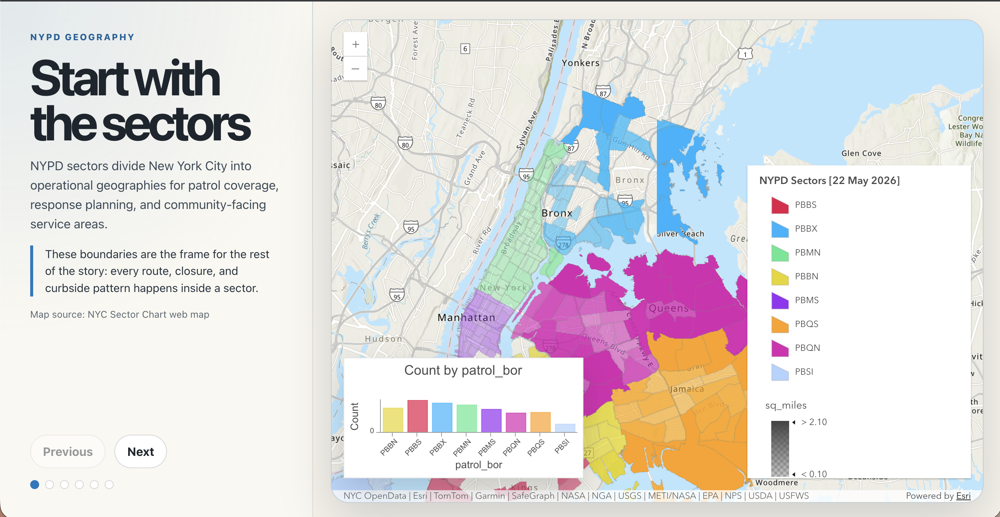
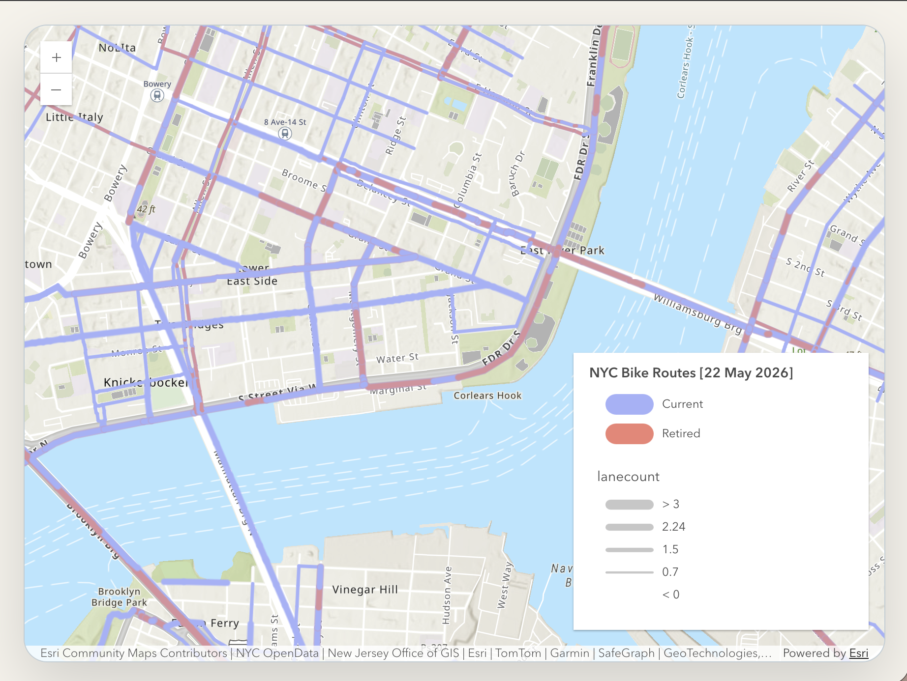
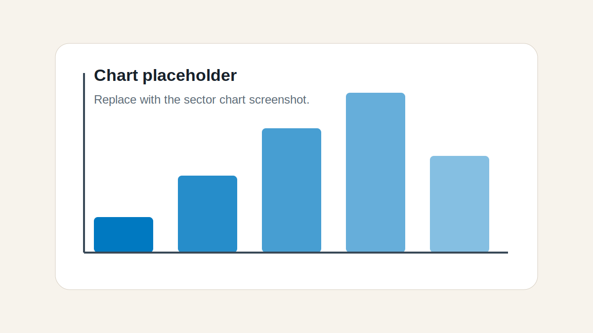

# NY Streets

An interactive ArcGIS web components demo that tells a short visual story about New York City street operations. The app combines NYPD sector geography with bike routes, truck routes, construction closures, parking meters, and a combined operational view.

**Live demo:** https://nystreets.netlify.app/



## What it shows

NY Streets is structured as a guided map story. Each step pairs a short narrative panel with an ArcGIS web map so readers can move through different operational layers:

- NYPD sector boundaries
- Bike route access
- Truck route corridors
- Construction-related street closures
- Parking meter and curbside activity
- A combined citywide operations view



## Built with

- [Lit](https://lit.dev/) for web components
- [ArcGIS Maps SDK for JavaScript web components](https://developers.arcgis.com/javascript/latest/references/map-components/)
- [ArcGIS Charts components](https://developers.arcgis.com/javascript/latest/references/charts-components/)
- [Vite](https://vite.dev/) for local development and production builds
- [Netlify](https://www.netlify.com/) for deployment

## Project structure

```text
src/
  app.ts                  Demo app coordinator
  components/
    story-map.ts          ArcGIS map and optional chart rendering
    story-navigation.ts   Previous/next and page dot controls
    story-panel.ts        Narrative content panel
  data/
    story-pages.json      Story page configuration and map IDs
  pages/
    index.ts              Typed story page registry
  types/
    story-page.ts         Shared page and ArcGIS slot types
```

The demo app intentionally stays lightweight: `demo-app` coordinates state, page data lives in JSON, and rendering is split across focused components. ArcGIS map rendering stays in light DOM so ArcGIS component slots and global styles behave correctly.

## Local development

Install dependencies:

```bash
pnpm install
```

Start the dev server:

```bash
pnpm dev
```

Build for production:

```bash
pnpm run build
```

Preview the production build:

```bash
pnpm preview
```

## Updating story pages

Edit `src/data/story-pages.json` to add or update pages. Each page supports:

```json
{
  "id": "sectors",
  "eyebrow": "NYPD geography",
  "title": "Start with the sectors",
  "mapItemId": "2de9da4390944b8f9e4cd4b04dffe70e",
  "zoom": 14,
  "description": "Short page description.",
  "insight": "Key takeaway for the reader.",
  "source": "Map source label",
  "chart": {
    "id": "2de9da4390944b8f9e4cd4b04dffe70e",
    "slotPosition": "top-right"
  }
}
```

`chart` is optional. When present, `slotPosition` must match one of the ArcGIS map component slot positions supported by `ArcgisMapSlotPosition` in `src/types/story-page.ts`.



## Deployment

The app is deployed on Netlify at:

https://nystreets.netlify.app/

The production build command is:

```bash
pnpm run build
```

The generated site is published from `dist/`.
